<!--
theme: gaia
class:
 - invert
headingDivider: 2
paginate: true
style: |
  section {
    background-color: #ccc;
  }
-->

<!--
_class:
 - lead
 - invert
-->

# CSS单位和响应式


## 绝对单位
1. 最常用的是px
2. 不常用的：
    a. mm (毫米)
    b. cm (厘米)
    c. in (英寸)
    d. pt (点)
    e. pc (派卡)
3. 换算：1in = 25.4mm = 2.54cm = 6pc = 72pt = 96px


## 相对单位
1. em
2. rem
3. vw (视口宽度的1/100)
4. vh (视口高度的1/100)
5. vmin (视口宽高较小一边的1/100)
6. vmax (视口宽高较大一边的1/100)

[点我了解更多长度单位](https://developer.mozilla.org/zh-CN/docs/Web/CSS/length#px) 

## 聊聊相对单位
### em
   
* em 最常见的相对长度单位，适合基于特定的字号进行排版，1em = 当前元素的字号

```css
.box {
  font-size: 18px;
  padding: 1em;
}
```

这里的1em就相当于18px; 
浏览器会根据相对单位的值计算出绝对值，计算出来的值就叫做`计算值`


## 


## 给不同的元素加上em
```html
<div className={CS([styles.box, styles.boxSmall])}>
   When we were learning about using the Effect Hook
</div>
<div className={CS([styles.box, styles.boxLarge])}>
   When we were learning about using the Effect Hook
</div>
```


##

```css
.box {
    padding: 1em;
    border-radius: 1em;
}
.boxSmall {
    font-size: 12px;
}
.boxLarge {
    font-size: 18px;
}
```

##
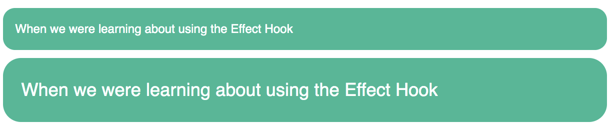

所以当设置**padding、height、width、border-radius**等属性时，使用em会很方便。

这是因为当元素继承了不同的字号，或用户改变了字体设置时，就会改变em的局部含义，这些属性就会跟着元素均匀的缩放了

## 使用em定义字号

如果设置font-size: 1.5em，那是怎么算的呢？肯定不是等于自己的1.5倍吧？

##
其实font-size是根据继承的字号来计算的
```html
      <div className={styles.parent}>
        <div className={styles.childTitle}>use the Effect Hook</div>
        We could copy and paste similar logic above into our FriendListItem component but it
        wouldn’t be ideal
      </div>
```
```css
.parent {
    font-size: 20px;
}
.childTitle {
    font-size: 1.2em;
}
```

##
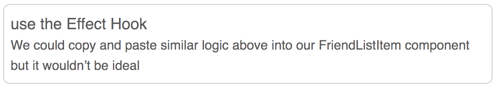

`提示`：如果知道字号的像素值，但是想用em声明，可以用一个简单的公式换算：**用想要的像素大小 / 继承的像素字号**


## em同时用于字号和其他属性
&ensp;&ensp;&ensp;&ensp;em的复杂之处在于同时用它指定一个元素的字号和其他属性。这时，浏览器必须先计算字号，然后用这个计算值去算出其余的属性值。这两类属性可以拥有一样的声明值，但是计算值不一样。
```css
.body {
  font-size: 16px;
}

.slogan {
    font-size: 1.2em;
    padding: 1.2em;
    .borderNormal(dashed)
}
```
## 
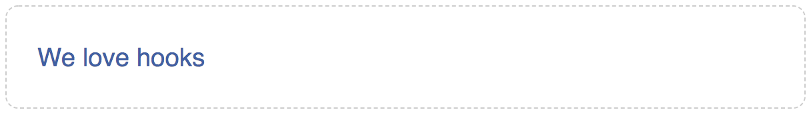

可以看出边距要比文字大一丢丢
font-size: 1.2 * 16 = 19.2px
padding: 1.2 * 19.2 = 23.04px

## 使用em可能会造成的问题
&ensp;&ensp;&ensp;&ensp;当em来指定多重嵌套的元素的字号时，就可能产生问题。为了算出每个元素的计算值，就需要知道继承的字号，如果这个值是在父元素上用em定义的，就需要知道父元素的继承值，以此类推，就会沿着DOM树一直往上查找。

&ensp;&ensp;&ensp;&ensp;比如：当使用em给列表元素定义字号并且多级嵌套时，就会出现字体缩小的问题

##
```html
<ul>
    <li>
      一级列表
      <ul>
        <li>
          二级列表
          <ul>
            <li>
              三级列表
              <ul>
                <li>
                  四级列表
                  <ul>
                    <li>五级列表</li>
                  </ul>
                </li>
              </ul>
            </li>
          </ul>
        </li>
      </ul>
    </li>
</ul>
```
##
```css
ul {
   font-size: .8em; 
}
```
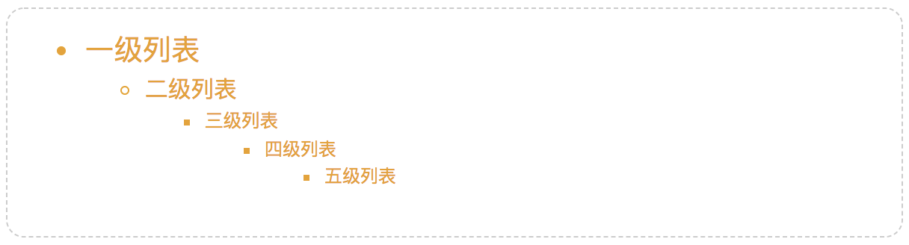

##
&ensp;&ensp;&ensp;&ensp;每个列表元素的字号都要乘以一个小于1的数，文字会越来越小，如果指定一个大于1em的字号，文字会越来越大，而我们想要的是顶部设定字号，然后子级的字号是一样的。

&ensp;&ensp;&ensp;&ensp;怎么解决呢？

##
方法一：在ul外面包一层容器 为其设置font-size
```html
<div className={styles.menuList}>
  <ul>...</ul>
</div>
```
```css
.menuList {
  font-size: .8em;
}
```

##
```css
ul {
  font-size: .8em;
}
ul ul {
  font-size: 1em;
}
```
##
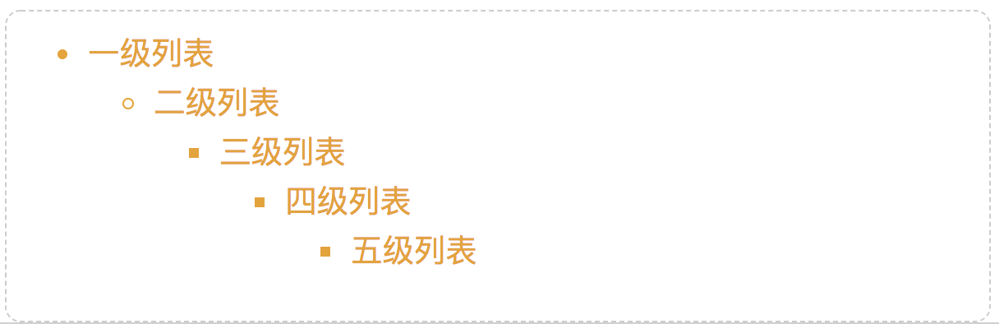

这两个方式都不是特别的好


## rem
### 1.rem设置字号
&ensp;&ensp;&ensp;&ensp;rem 是root em 的缩写，rem不是相当于当前元素，而是相对于根元素的单位。`不管在文档的哪个位置，都有相同的计算值`。

&ensp;&ensp;&ensp;&ensp;用rem来解决上面的问题。
```css
body {
  font-size: 1em;
}
ul {
  font-size: .8rem;
}
```
##
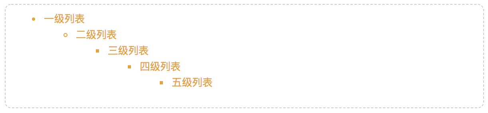

## 补充
&ensp;&ensp;&ensp;&ensp;浏览器可以有两种方式来设置文字大小：缩放和设置字号

&ensp;&ensp;&ensp;&ensp;缩放：可以缩放所有的字和图片，让网页整体放大或者缩小，但这种基本只对当前标签生效

&ensp;&ensp;&ensp;&ensp;设置字号：设置字号会永久生效，除非重新设置大小，这种方式的缺点是它不会影响px或者其他绝对单位设置的字号，由于默认字号对某些用户而言是很重要的，尤其是视力不好的人...


##
```css
body {
  font-size: 16px;
}
```
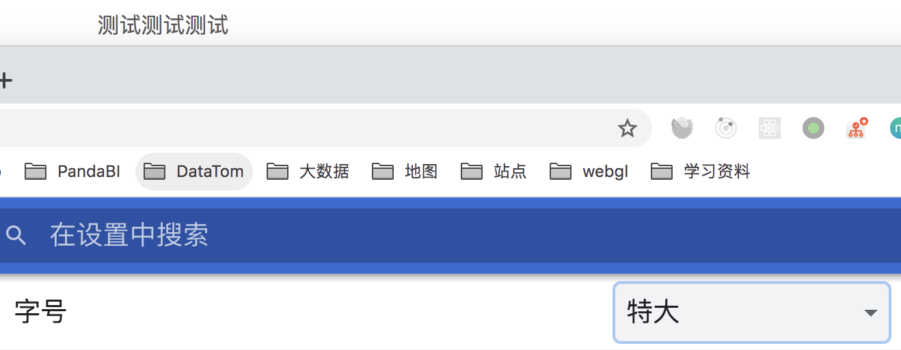

##
```css
body {
  font-size: 1rem;
}
```
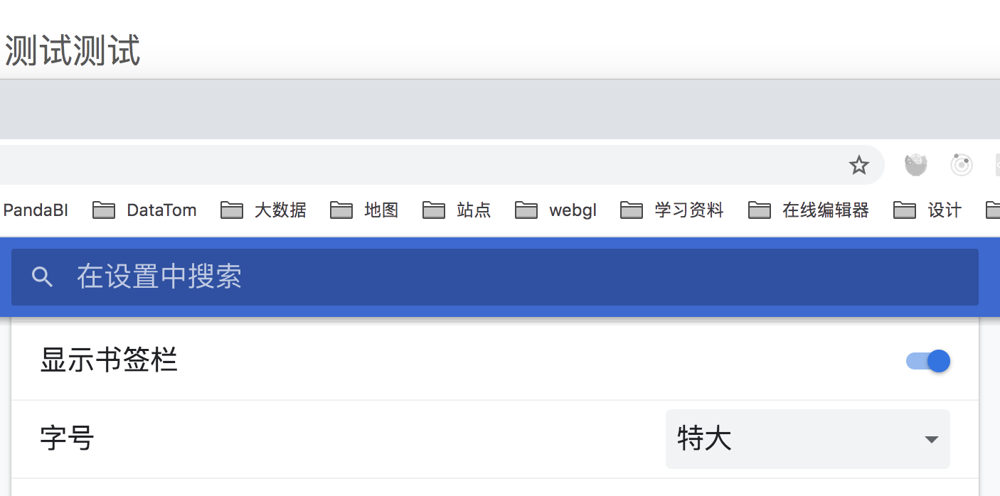


##
&ensp;&ensp;&ensp;&ensp;与em相比，rem降低了复杂性。实际上，rem结合了px和em的有点，既保留了相对单位的优势，又简单易用，但不是所有的都用rem

&ensp;&ensp;&ensp;&ensp;一般可以使用rem设置字号，用px设置边框，用em设置其他大部分属性


## 视口的相对单位

* vw（视口宽度的1/100）
* vh（视口高度的1/100）
* vmin（视口宽高较小的1/100）
* vmax（视口宽高较大的1/100）

50vw = 视口宽度的一半 25vh = 适口高度的1/4，vmin在横屏时取决于高度，在竖屏时取决于宽度

## 

```css
.box {
  width: 90vmin;
  height:90vmin; 
}
```
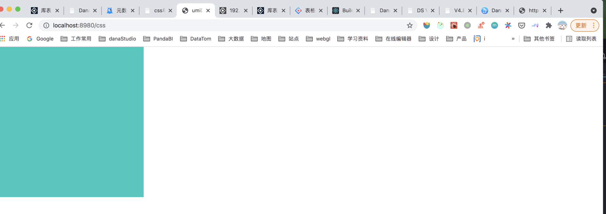

##
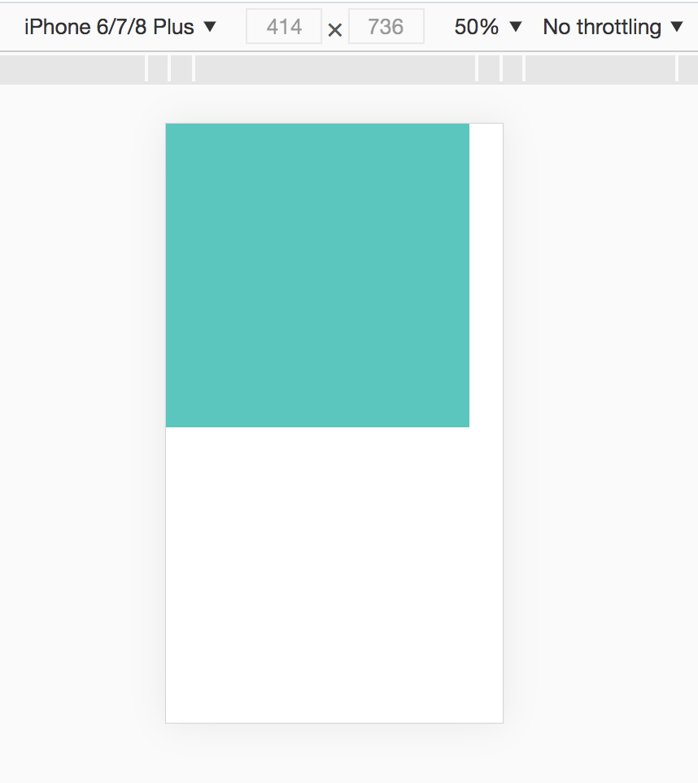


## 使用vw定义字号

&ensp;&ensp;&ensp;&ensp;相对视口单位还有个不起眼的用途，就是设置字号，感觉比设置元素的宽高还要实用

```css
.text {
  font-size: 2vw;
}
```
&ensp;&ensp;&ensp;&ensp;对于一个1440px宽度屏幕来说，就相当于1440 * 2% = 28.8px 在一个768的屏幕上显示15px(768 * 2%)


##
&ensp;&ensp;&ensp;&ensp;这样做的好处是元素能够在多种宽度屏幕大小之间平滑的过渡，不会因为在某个断点突然改变。

&ensp;&ensp;&ensp;&ensp;但有个问题是，如果屏幕太小，字体也会变得很小

## 使用calc()定义字号
&ensp;&ensp;&ensp;&ensp;calc()函数可以对两个及其以上的值进行基本运算，支持加减乘除

```css
body {
  font-size: calc(1em + 1vw)
}
```
&ensp;&ensp;&ensp;&ensp;现在缩放浏览器的话，字体就会平滑的缩放，1em保证了最小的字号（大小可以根据实际情况定义）

##
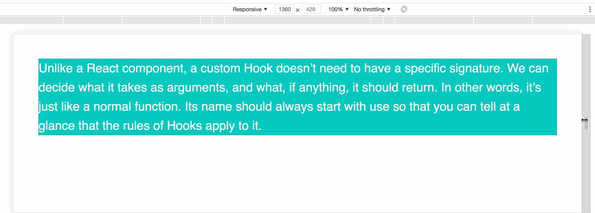


## 响应式相关
响应式设计原则

&ensp;&ensp;&ensp;&ensp;1. 移动优先：在实现web端布局之前先构建移动版的布局
&ensp;&ensp;&ensp;&ensp;2. @media规则
&ensp;&ensp;&ensp;&ensp;3. 流式布局


##
为什么要移动优先？

&ensp;&ensp;&ensp;&ensp;移动版页面有很多限制，屏幕空间受限，交互方式多变，如果先就设计一个全部交互的网站，然后再根据移动设备的限制来制约网站的功能，往往后期会耗费更大的成本甚至整体失败

&ensp;&ensp;&ensp;&ensp;优先考虑移动版，将移动版的体验做好了，就可以用“渐进增强”的方式为大屏用户增加体验了。


## 媒体查询@media
[详情请点击](https://developer.mozilla.org/zh-CN/docs/Web/CSS/Media_Queries/Using_media_queries)

&ensp;&ensp;&ensp;&ensp;断点的选择：不要只想着参考设备的宽高，要在实际的验证中去设置断点，因为市面上设备太多了。考虑不过来，而选择适合的断点，不管在什么设备上都能够有很好的展示效果

## 流式布局
&ensp;&ensp;&ensp;&ensp;不设置固定的宽高就好，用百分比或者flex布局

## 响应式字号设置
```css
:root {
  font-size: .75em;
}
@media (min-width: 800px) {
  :root {
    font-size: 0.875em;
  }
} 
@media (min-width: 1200px) {
  :root {
    font-size: 1em;
  }
} 
```
## 响应式图片
&ensp;&ensp;&ensp;&ensp;背景图片可以用@media设置
```css
@media (min-width: 35em) {
  .hero {
    padding: 5em 3em;
    font-size: 1.2rem;
    background-image: url(brand-medium.jpg);
} }
@media (min-width: 50em) {
  .hero {
    padding: 7em 6em;
    background-image: url(brand.jpg);
  }
}
```
##
媒体查询能够解决css加载图片的问题，但是img标签呢？

##

就要用到srcset + sizes属性了

[The anatomy of responsive images](https://jakearchibald.com/2015/anatomy-of-responsive-images/)

##
```html

```
每张图像的 URL 后面是一个空格，再加上宽度描述符。
宽度描述符就是图像原始的宽度，加上字符w
sizes属性列出不同设备的图像显示宽度。
##
上面代码中，sizes属性给出了三种屏幕条件，以及对应的图像显示宽度。宽度不超过440像素的设备，图像显示宽度为100%；宽度441像素到900像素的设备，图像显示宽度为33%；宽度900像素以上的设备，图像显示宽度为254px

浏览器根据当前设备的宽度，从sizes属性获得图像的显示宽度，然后从srcset属性找出最接近该宽度的图像，进行加载。

假定当前设备的屏幕宽度是480px，浏览器从sizes属性查询得到，图片的显示宽度是33vw（即33%），等于160px。srcset属性里面，正好有宽度等于160px的图片，于是加载foo-160.jpg。

注意，sizes属性必须与srcset属性搭配使用。单独使用sizes属性是无效的。

## sass中响应式写法
1. 支持嵌套媒体查询
```css
section.main { 
  font-size: 16px; 
  line-height: 1.4; 
  @media screen and (max-width: $width-large) {
     float: left; width: 65%; 
  } 
  @media screen and (max-width: $width-medium) { 
    float: none; width: auto; 
  } 
  @media screen and (max-width: $width-small) { 
    font-size: 12px; line-height: 1.4; 
  }
 }
```

##
2. @content和mixins的结合用法
```css
$width-small: 400px; 
$width-medium: 760px; 
$width-large: 1200px; 
@mixin responsive($width) { 
  @if $width == wide-screens { 
    @media only screen and (max-width: $width-large) { @content; } }
  @else if $width == medium-screens { 
    @media only screen and (max-width: $width-medium) { @content; } } 
  @else if $width == small-screens { 
    @media only screen and (max-width: $width-small) { @content; } 
  }
}
```
##
```css
#content { 
  float: left; 
  width: 70%; 
  @include responsive(wide-screens) { width: 80%; } 
  @include responsive(medium-screens) { width: 50%; font-size: 14px; } 
  @include responsive(small-screens) { float: none; width: 100%; font-size: 12px; } 
}

```
## less响应式写法
```css

.custom(@width, ...) {
  ...
}
@media (max-width:1200px){
    .custom(960px,180px);
}
@media (max-width:768px){
    .custom(480px,80px);
}
@media (max-width:480px){
    .custom(100%,10%);
}
```


# 🎉🎉🎉
<!--
_class:
 - lead
 - invert
-->
### Happy holidays to you all！

